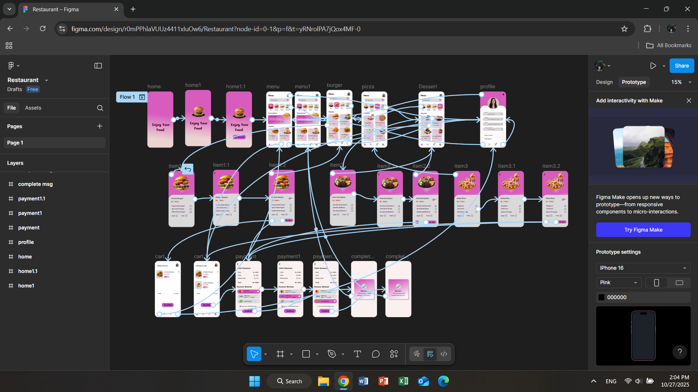
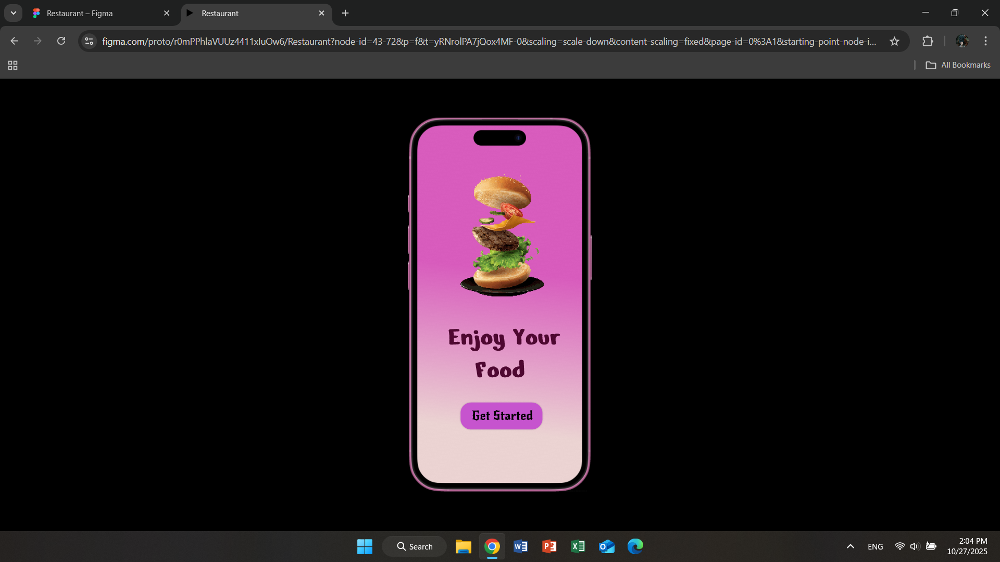
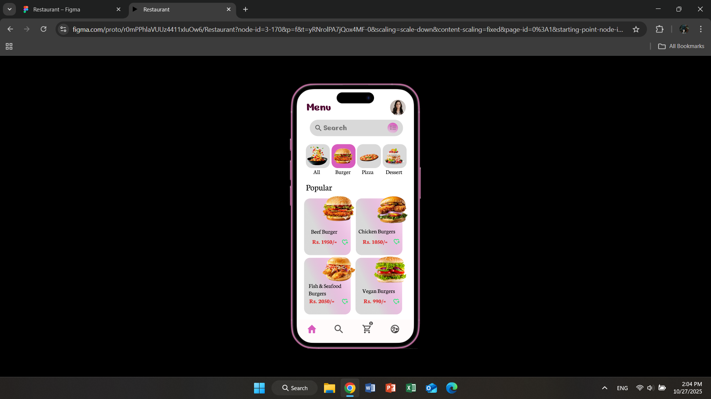
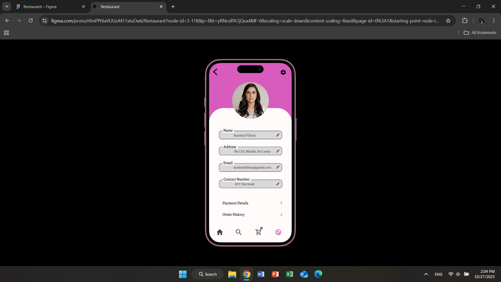
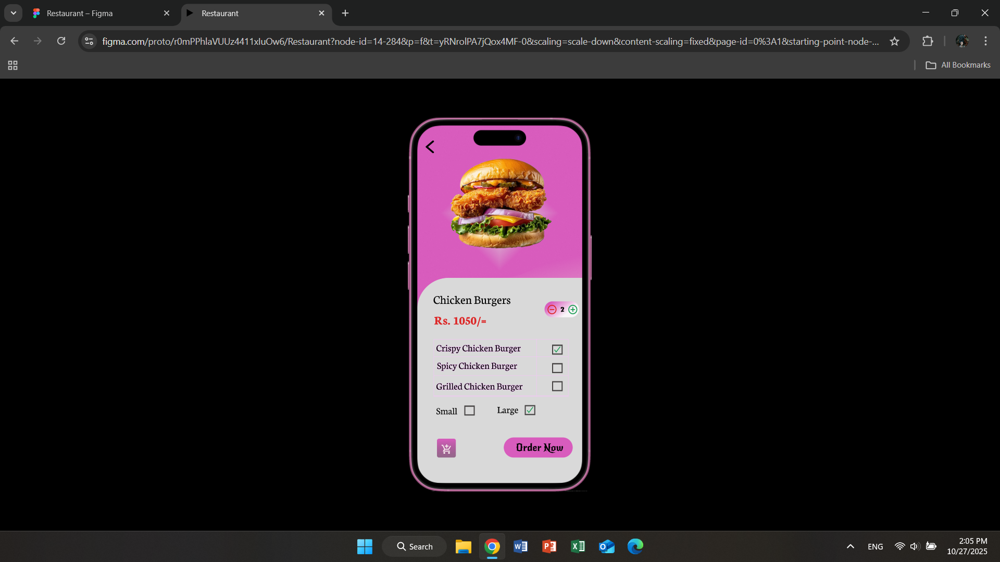

# Restaurant – UI/UX Design

🎨 Modern mobile app interface for order foods in Sri Lanka.

## 📱 Overview
This UI/UX design showcases:
- Home page
- Menu pages
- Food Item pages
- Profile
- Cart & Checkout with Success Messsage 

## 🔗 Figma Prototype
[View on Figma](https://www.figma.com/design/r0mPPhlaVUUz4411xIuOw6/Restaurant?node-id=0-1&m=dev&t=yRNrolPA7jQox4MF-1)

## 🖼️ Preview

## 👩‍🎨 Tools Used
- Figma
